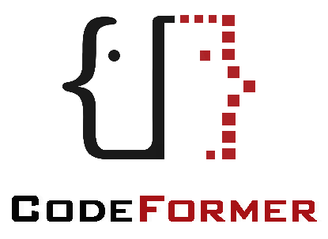
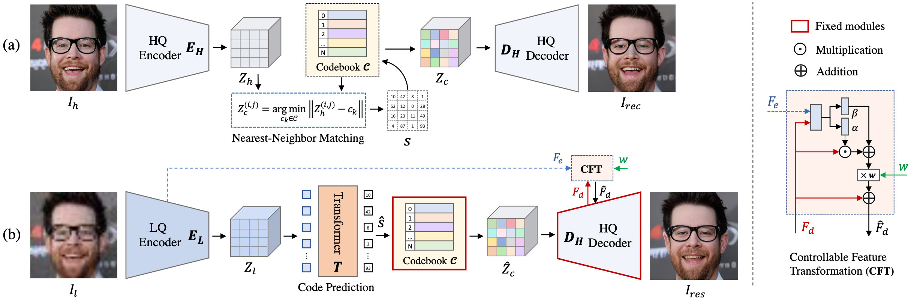
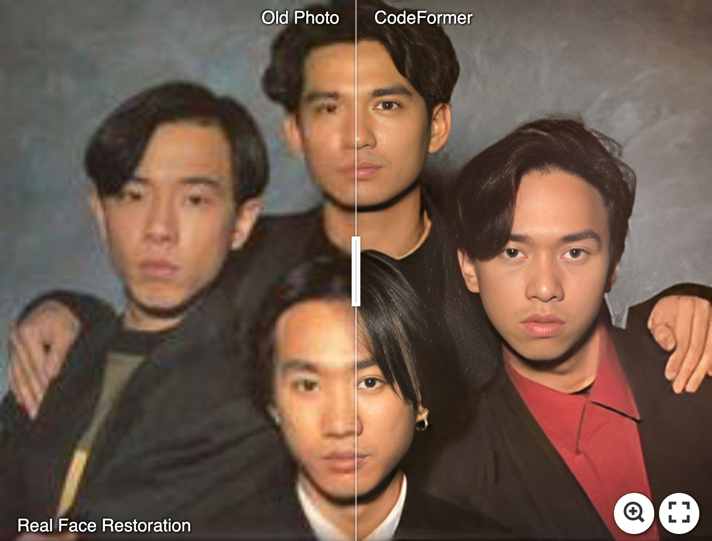
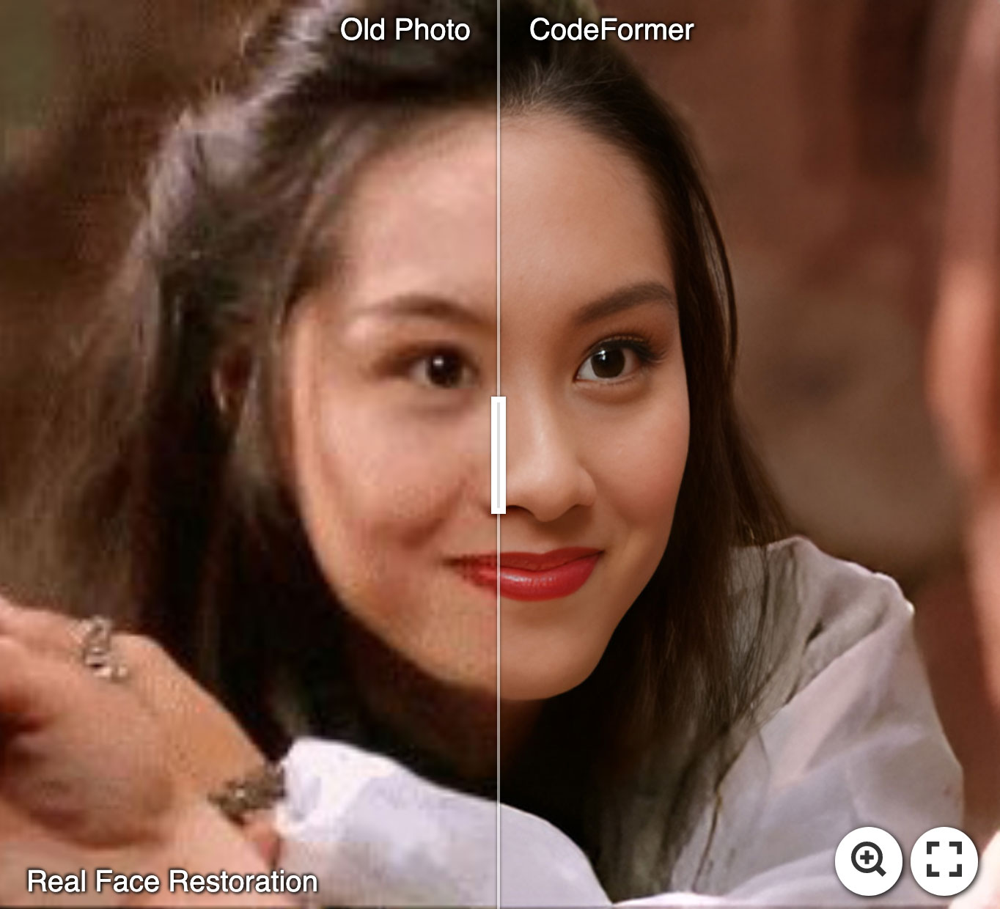
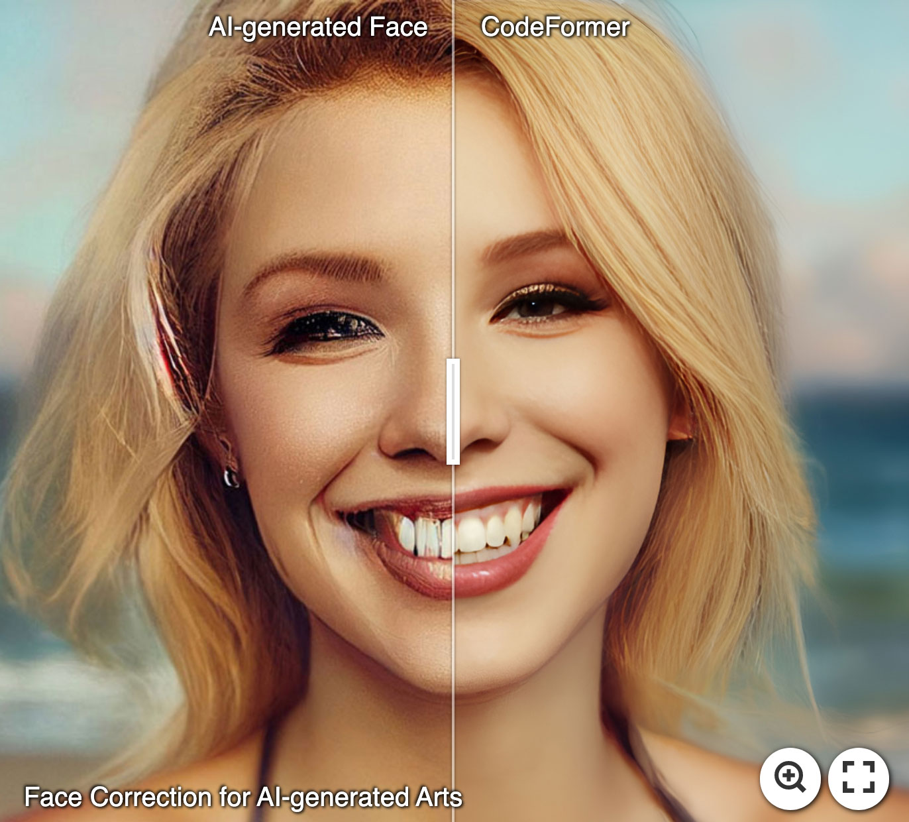
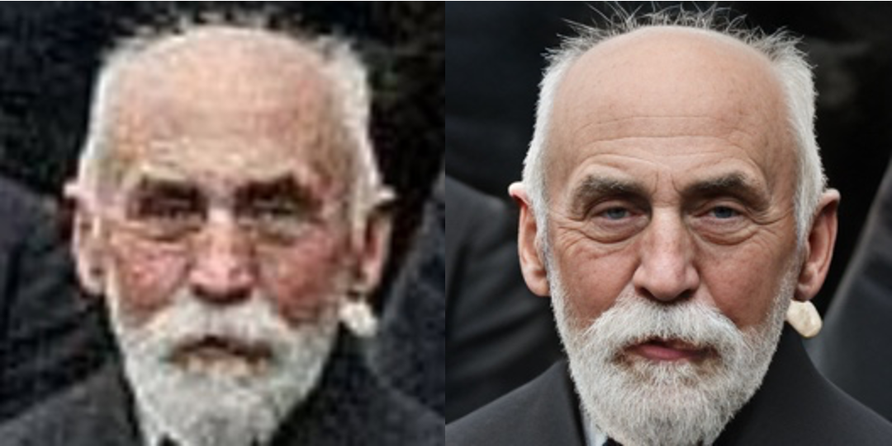
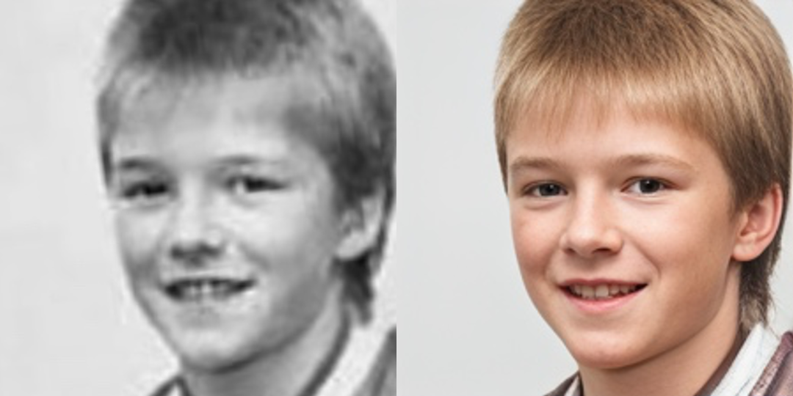
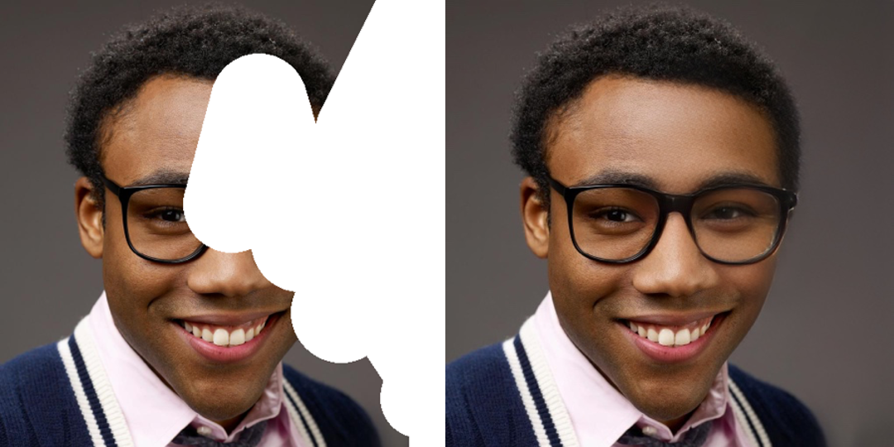
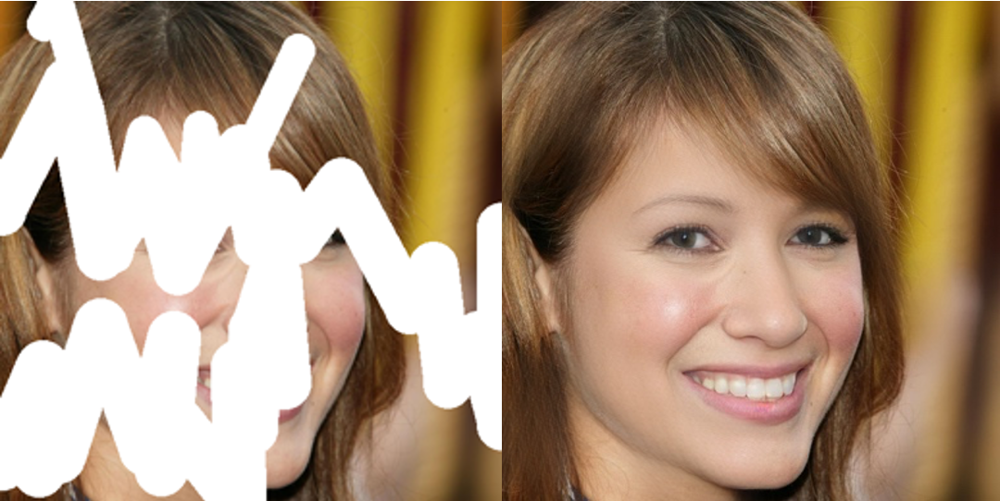

<p align="center">
  
</p>

## Towards Robust Blind Face Restoration with Codebook Lookup Transformer (NeurIPS 2022)

[Paper](https://arxiv.org/abs/2206.11253) | [Project Page](https://shangchenzhou.com/projects/CodeFormer/) | [Video](https://youtu.be/d3VDpkXlueI)


<a href="https://colab.research.google.com/drive/1m52PNveE4PBhYrecj34cnpEeiHcC5LTb?usp=sharing"></a> [](https://huggingface.co/spaces/sczhou/CodeFormer) [](https://replicate.com/sczhou/codeformer) [](https://openxlab.org.cn/apps/detail/ShangchenZhou/CodeFormer) 


[Shangchen Zhou](https://shangchenzhou.com/), [Kelvin C.K. Chan](https://ckkelvinchan.github.io/), [Chongyi Li](https://li-chongyi.github.io/), [Chen Change Loy](https://www.mmlab-ntu.com/person/ccloy/) 

S-Lab, Nanyang Technological University




:star: If CodeFormer is helpful to your images or projects, please help star this repo. Thanks! :hugs: 


---

> ### About this fork
>
> Maintained by **Akil**. This fork updates the upstream project to run on modern
> toolchains — Python 3.10–3.13, PyTorch ≥ 2.2, TorchVision ≥ 0.17, NumPy 2.x and
> SciPy ≥ 1.15. No model architecture, weights, or numerical behaviour were changed;
> published checkpoints load unmodified. See [MIGRATION.md](MIGRATION.md) for the
> full change log.
>
> All research credit belongs to the original authors listed above. This fork is not
> affiliated with, or endorsed by, S-Lab or Nanyang Technological University.

---


## Quick start

This repo does two jobs. **CodeFormer** rebuilds blurry, old, damaged or AI-generated faces, and **Real-ESRGAN** upscales everything else in the picture (2x/4x). Video is processed frame by frame and re-assembled with its audio.

> **License:** code and model weights are under the NTU S-Lab License 1.0, **non-commercial use only**. Do not sell it as a service or use it in paid client work without written permission from S-Lab, NTU.

### 1. Install the tools (one time)

Windows (PowerShell):

```powershell
winget install --id Git.Git -e
winget install --id Python.Python.3.11 -e
winget install --id Gyan.FFmpeg -e      # only needed for video
```

macOS: `brew install git python@3.11 ffmpeg` · Ubuntu/Debian: `sudo apt install git python3.11 python3.11-venv ffmpeg`

Close and reopen the terminal afterwards so the new commands are found.

### 2. Get the code and create an isolated Python environment

```powershell
git clone https://github.com/JeevaNadar1/image_and_video_upscale.git
cd image_and_video_upscale
py -3.11 -m venv .venv
.\.venv\Scripts\Activate.ps1
```

On macOS/Linux use `python3.11 -m venv .venv` and `source .venv/bin/activate`. If Windows says running scripts is disabled, run `Set-ExecutionPolicy -Scope Process Bypass` (affects only that window) and activate again. Your prompt now starts with `(.venv)`; repeat the activate line every time you open a new terminal.

### 3. Install PyTorch, then the rest

Pick **one** PyTorch line:

```powershell
# No NVIDIA GPU (works everywhere, slower)
pip install torch torchvision --index-url https://download.pytorch.org/whl/cpu

# NVIDIA GPU: copy the pip command for your CUDA version from https://pytorch.org/get-started/locally/
# Apple Silicon Mac: pip install torch torchvision   (uses the Mac GPU automatically)
```

```powershell
pip install -r requirements.txt
```

### 4. Check it works

```powershell
python scripts/smoke_test.py
```

The first run downloads about 550 MB of model weights into `weights/`. It should end with `OK: ... Your install works.`

## Using it

All results go to `results/` unless you pass `-o <folder>`.

| Goal | Command |
|---|---|
| Restore faces in one photo | `python inference_codeformer.py -w 0.7 -i photo.jpg` |
| Restore faces **and** upscale the whole photo | `python inference_codeformer.py -w 0.7 -i photo.jpg --bg_upsampler realesrgan --face_upsample` |
| Upscale 4x instead of 2x | add `-s 4` |
| A whole folder of photos | `python inference_codeformer.py -w 0.7 -i C:\path\to\folder --bg_upsampler realesrgan` |
| A video (keeps the audio) | `python inference_codeformer.py -w 1.0 -i clip.mp4 --bg_upsampler realesrgan --face_upsample` |
| Colorize a black-and-white face (cropped 512x512) | `python inference_colorization.py -i face.png` |
| Fill in a damaged face (white-brushed, 512x512) | `python inference_inpainting.py -i face.png` |
| Browser UI (drag and drop) | `pip install "gradio>=4.44"` then `python web-demos/hugging_face/app.py` and open http://127.0.0.1:7860 |

Supported inputs: images `.jpg .jpeg .png .webp .bmp`; videos `.mp4 .mov .avi .mkv .webm`.

**The `-w` setting (0 to 1):** lower values give a cleaner, more "enhanced" face; higher values stay closer to the original person. Start at `0.7` for photos and `1.0` for video (keeps faces consistent between frames).

**Where results land:** `final_results/` holds the finished images, `restored_faces/` and `cropped_faces/` hold each face before and after. For video you get a single `.mp4`.

**Speed:** everything works on CPU, but Real-ESRGAN and video are slow there. For anything beyond short clips, use an NVIDIA GPU.

## Troubleshooting

1. `No module named ...`: the virtual environment is not active. Run the activate line from step 2.
2. `ffmpeg was not found on PATH`: install ffmpeg (step 1) and open a new terminal.
3. Out of memory with `--bg_upsampler`: add `--bg_tile 200` (smaller tiles use less memory) or use `-s 2`.
4. Downloads fail behind a firewall: fetch the files from the [v0.1.0 release](https://github.com/sczhou/CodeFormer/releases/tag/v0.1.0) and place them in `weights/CodeFormer`, `weights/facelib` and `weights/realesrgan`.
5. A photo is skipped with "could not read": the file is corrupt or not a real image; re-save it as JPG or PNG.

---

### Results from the original authors

#### :panda_face: Try Enhancing Old Photos / Fixing AI-arts
[](https://imgsli.com/MTI3NTE2) [](https://imgsli.com/MTI3NTE1) [](https://imgsli.com/MTI3NTIw) 

#### Face Restoration

 
 

#### Face Color Enhancement and Restoration

 

#### Face Inpainting

 


### Training:
The training commands can be found in the documents: [English](docs/train.md) **|** [简体中文](docs/train_CN.md).

### License

This project is licensed under <a rel="license" href="https://github.com/sczhou/CodeFormer/blob/master/LICENSE">NTU S-Lab License 1.0</a>. Redistribution and use should follow this license.

---
### 🐼 Ecosystem Applications & Deployments

CodeFormer has been widely adopted and deployed across a broad range (>20) of online applications, platforms, API services, and independent websites, and has also been integrated into many open-source projects and toolkits.

> Only demos on **Hugging Face Space**, **Replicate**, and **OpenXLab** are official deployments **maintained by the authors**. All other demos, APIs, apps, websites, and integrations listed below are **third-party (non-official)** and are not affiliated with the CodeFormer authors. Please verify their legitimacy to avoid potential financial loss.


#### Websites (Non-official)

⚠️⚠️⚠️ The following websites are **not official and are not operated by us**. They use our models without any license or authorization. Please verify their legitimacy to avoid potential financial loss.


| Website | Link | Notes |
|---------|------|--------|
| CodeFormer.net | https://codeformer.net/ | Non-official website |
| CodeFormer.cn | https://www.codeformer.cn/ | Non-official website |
| CodeFormerAI.com | https://codeformerai.com/ | Non-official website |

#### Online Demos / API Platforms

| Platform | Link | Notes |
|----------|------|--------|
| Hugging Face | https://huggingface.co/spaces/sczhou/CodeFormer | Maintained by Authors |
| Replicate | https://replicate.com/sczhou/codeformer | Maintained by Authors |
| OpenXLab | https://openxlab.org.cn/apps/detail/ShangchenZhou/CodeFormer |Maintained by Authors |
| Segmind | https://www.segmind.com/models/codeformer | Non-official |
| Sieve | https://www.sievedata.com/functions/sieve/codeformer | Non-official |
| Fal.ai | https://fal.ai/models/fal-ai/codeformer | Non-official |
| VaikerAI | https://vaikerai.com/sczhou/codeformer | Non-official |
| Scade.pro | https://www.scade.pro/processors/lucataco-codeformer | Non-official |
| Grandline | https://www.grandline.ai/model/codeformer | Non-official |
| AI Demos | https://aidemos.com/tools/codeformer | Non-official |
| Synexa | https://synexa.ai/explore/sczhou/codeformer | Non-official |
| RentPrompts | https://rentprompts.ai/models/Codeformer | Non-official |
| ElevaticsAI | https://elevatics.ai/models/super-resolution/codeformer | Non-official |
| Anakin.ai | https://anakin.ai/apps/codeformer-online-face-restoration-by-codeformer-19343 | Non-official |
| Relayto | https://relayto.com/explore/codeformer-yf9rj8kwc7zsr | Non-official |


#### Open-Source Projects & Toolkits

| Project / Toolkit | Link | Notes |
|-------------------|------|--------|
| Stable Diffusion GUI | https://nmkd.itch.io/t2i-gui | Integration |
| Stable Diffusion WebUI | https://github.com/AUTOMATIC1111/stable-diffusion-webui | Integration |
| ChaiNNer | https://github.com/chaiNNer-org/chaiNNer | Integration |
| PyPI | https://pypi.org/project/codeformer/ ; https://pypi.org/project/codeformer-pip/ | Python packages |
| ComfyUI | https://stable-diffusion-art.com/codeformer/ | Integration |

---
### Acknowledgement

This project is based on [BasicSR](https://github.com/XPixelGroup/BasicSR). Some codes are brought from [Unleashing Transformers](https://github.com/samb-t/unleashing-transformers), [YOLOv5-face](https://github.com/deepcam-cn/yolov5-face), and [FaceXLib](https://github.com/xinntao/facexlib). We also adopt [Real-ESRGAN](https://github.com/xinntao/Real-ESRGAN) to support background image enhancement. Thanks for their awesome works.

### Citation
If our work is useful for your research, please consider citing:

    @inproceedings{zhou2022codeformer,
        author = {Zhou, Shangchen and Chan, Kelvin C.K. and Li, Chongyi and Loy, Chen Change},
        title = {Towards Robust Blind Face Restoration with Codebook Lookup TransFormer},
        booktitle = {NeurIPS},
        year = {2022}
    }


### Contact
If you have any questions, please feel free to reach me out at `shangchenzhou@gmail.com`. 

For issues specific to **this fork** (packaging, dependency, or Python/PyTorch
compatibility), open an issue on the fork rather than contacting the original authors.
Fork maintainer: **Akil**.
